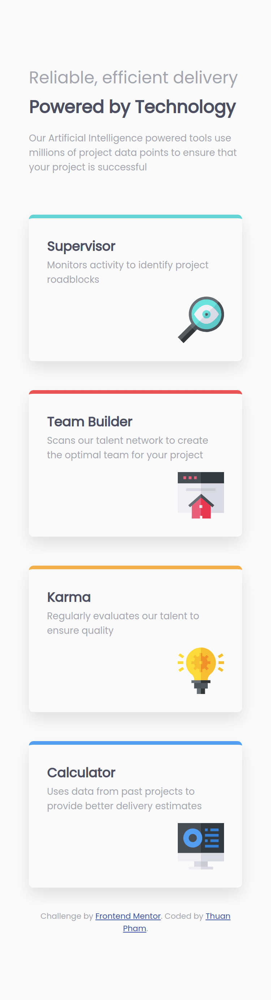

# Four card feature section

## Overview

Challenge by frontendmentor.io

**My ans**

https://thuanpham2311.github.io/four-card-feature-section/

## Review

### Phone

## Contributing workflow

Here’s how we suggest you go about proposing a change to this project:

1. [Fork this project][fork] to your account.
2. [Create a branch][branch] for the change you intend to make.
3. Make your changes to your fork.
4. [Send a pull request][pr] from your fork’s branch to our `master` branch.

[fork]: https://help.github.com/articles/fork-a-repo/
[branch]: https://help.github.com/articles/creating-and-deleting-branches-within-your-repository
[pr]: https://help.github.com/articles/using-pull-requests/

## License

[MIT License](./LICENSE).

**What is the MIT license?**

> Do whatever you want with this, just don’t sue me
